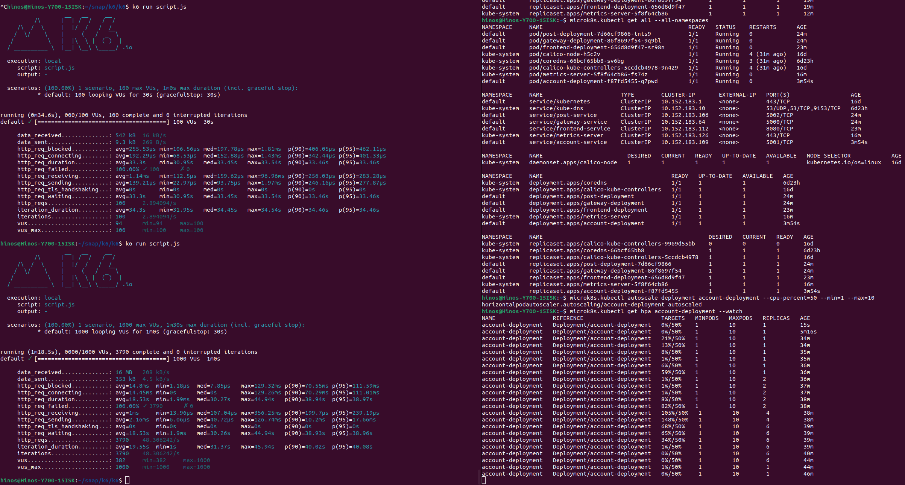

# Scalable Architecture

[Portfolio](../../README.md) | Scalable Architecture

[Uitleg leeruitkomst]: #

## Scale

| ID | Description | Type | Level |
|---|---|---|---|
| 4.1 | Architecture Documentation | IP | Orienting |
| 4.2 | Ocelot API Gateway | IP/GP | Beginning |
| 4.3 | Multiple viewpoint documentation | IP | Beginning |
| 4.4 | Kubernetes | IP | Beginning |
| 4.5 | Autoscaling and k6 | IP | Proficient |

## Argumentation

### 4.1: Architecture Documentation

Created first iteration of the architecture document. I have written my documentation in Markdown, so it's easier to link sections. I used C4 models to create different views of my systems. There is currently a container model showing the whole system and its connected cloud services, a deployment diagram to show how it would run in its production environment, and use case diagrams to show the functionality of the system.

### 4.2 Ocelot API Gateway

Implemented an Ocelot API Gateway for both the IP and GP. In the GP it will replace the existing Gateway as it was a bad implementation (using logic to retrieve information from multiple services in a single call). I use the same architecture in my IP so here ocelot was also viable.

### 4.3 Multiple viewpoint documentation

Build my architecture documentation in multiple view points using 4+1 view model. I use the viewpoints to describe different aspects of the system. Each individual only has to look for the viewpoints they apply to. Programmers might only need the service views, a developer responsible for deployment can use the deployment view.

### 4.4 Kubernetes

Application running in kubernetes. Using kubectl and microk8s on linux. See deployments for configuration.

### 4.5 Autoscaling and k6

Implementation of autoscaling deployments and validation through load testing using k6.

