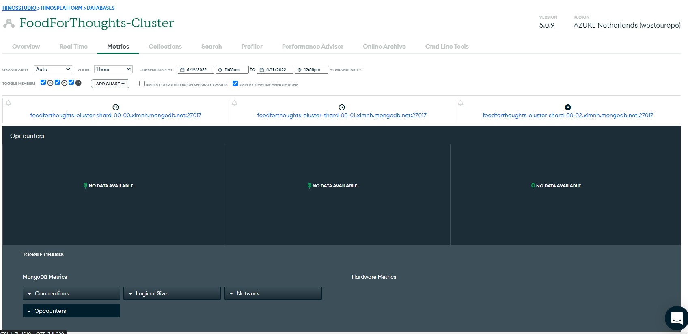
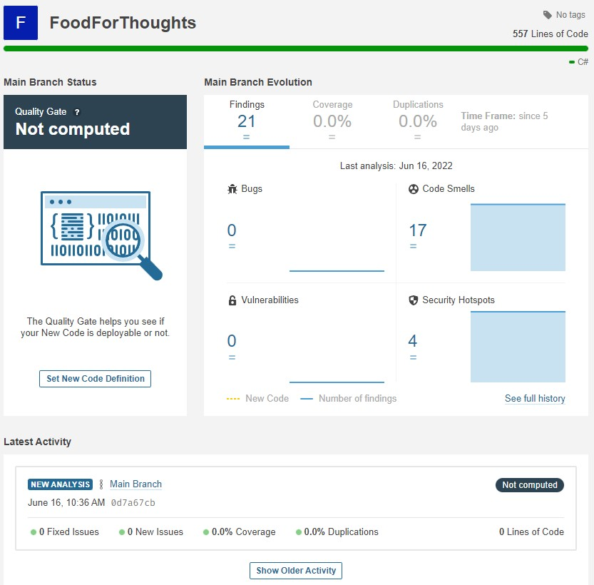

# Cloud Services

[Portfolio](../../README.md) | Cloud Services

[Uitleg leeruitkomst]: #

## Scale

| ID | Description | Type | Level |
|---|---|---|---|
| 6.1 | Cloud Service Orientation | IP | orienting |
| 6.2 | MongoDB cloud integration | IP | Beginning |
| 6.3 | SonarCloud cloud integration | IP | Beginning |
| 6.4 | 12-Factor app research | GP | Proficient |

## Argumentation

### 6.1: Cloud Service Orientation

In the first sprint I made the decision to use SonarCloud and MongoDB as cloud services in my system. 

SonarCloud will perform a static code analysis and is free to use for open source projects. 

MongoDB is a NoSQL database which you can use a free version of in the cloud, you can also run MongoDB as a docker container for local development. 

Next step is to implement both services.

### 6.2 MongoDB cloud integration

Used MongoDB to create a scalable NoSQL Datastore hosted by mongo on the cloud. mongo uses other cloud providers like azure to host a cluster. The free tier allows the user to have a preset cluster with 3 shards. On higher tier clusters the user can configure more scaling.

### 6.3 SonarCloud cloud integration

Used SonarCloud for static code analysis in my CI pipeline. For every commit I will be notified on any bugs, code smells, and security vulnerabilities in the project.

### 6.4 12-Factor app research

The 12-factor app is a guide for building SaaS applications. See case cloud computing and services for research.